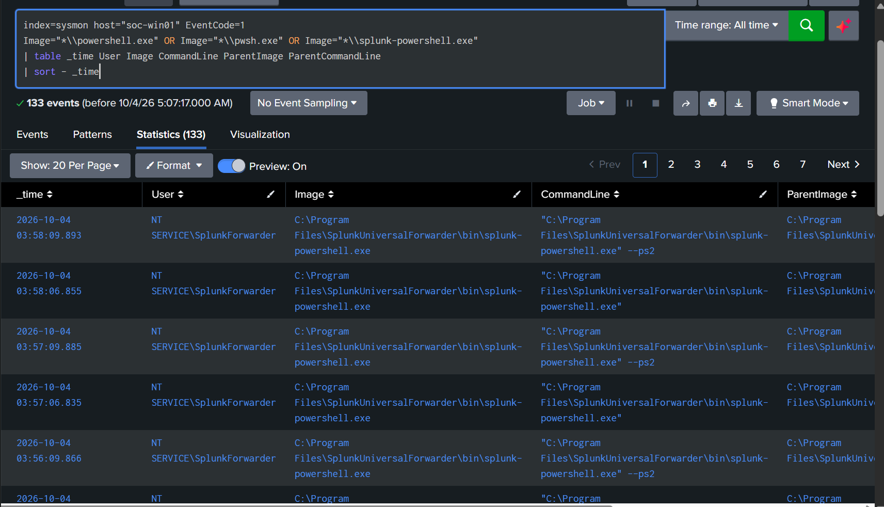
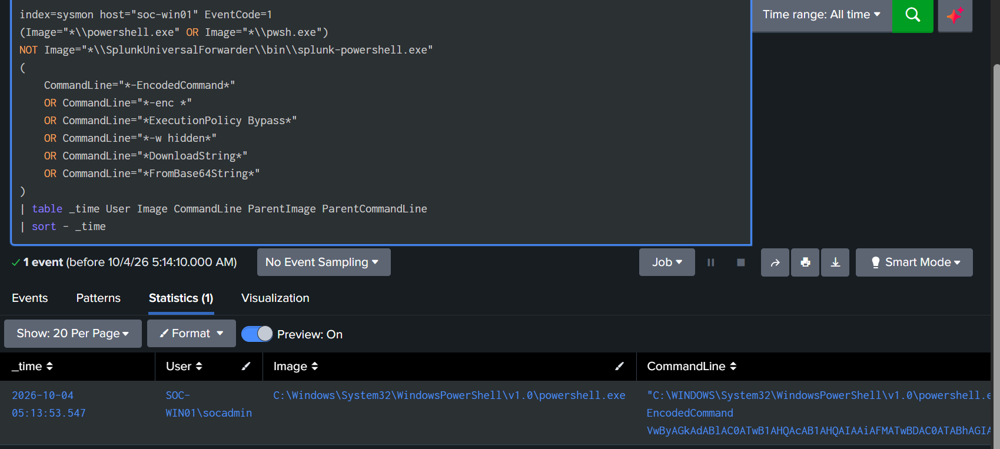
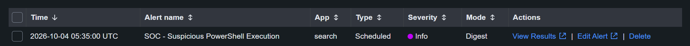

# Detection 01 — Suspicious PowerShell Execution

## Overview

This detection identifies potentially suspicious PowerShell execution on the monitored Windows endpoint `SOC-WIN01`.

PowerShell is a legitimate administrative tool but is also commonly abused by attackers for execution, downloading payloads, encoded commands, and defense evasion.

This detection focuses on suspicious command-line characteristics while excluding known legitimate Splunk Universal Forwarder PowerShell activity.

---

## Detection Objective

Identify PowerShell processes using command-line arguments commonly associated with suspicious or malicious execution.

The detection looks for:

- Encoded PowerShell commands
- Execution policy bypass
- Hidden PowerShell windows
- `DownloadString`
- `FromBase64String`

---

## Data Source

| Component | Value |
|---|---|
| Endpoint | `SOC-WIN01` |
| Telemetry Source | Sysmon |
| Sysmon Event ID | `1` — Process Creation |
| Splunk Index | `sysmon` |
| Splunk Host | `soc-win01` |
| SIEM | Splunk Enterprise |

---

## Baseline Analysis

Before creating the detection, normal PowerShell activity was reviewed.

The baseline showed frequent execution of:

`C:\Program Files\SplunkUniversalForwarder\bin\splunk-powershell.exe`

under:

`NT SERVICE\SplunkForwarder`

This activity was identified as expected Splunk Universal Forwarder behavior and excluded from the detection to reduce false positives.

Evidence:



---

## Detection SPL

```spl
index=sysmon host="soc-win01" EventCode=1
(Image="*\\powershell.exe" OR Image="*\\pwsh.exe")
NOT Image="*\\SplunkUniversalForwarder\\bin\\splunk-powershell.exe"
(
    CommandLine="*-EncodedCommand*"
    OR CommandLine="*-enc *"
    OR CommandLine="*ExecutionPolicy Bypass*"
    OR CommandLine="*-w hidden*"
    OR CommandLine="*DownloadString*"
    OR CommandLine="*FromBase64String*"
)
| table _time User Image CommandLine ParentImage ParentCommandLine
| sort - _time
```

---

## Detection Logic

The search requires Sysmon Event ID `1`, a process image ending in `powershell.exe` or `pwsh.exe`, and at least one of the listed command-line patterns.

The result table shows the user, image, command line, and parent-process context needed for triage. The explicit Splunk Universal Forwarder exclusion records the known baseline; the preceding image filter already excludes `splunk-powershell.exe`.

This is a pattern-based lab detection. Alternate argument forms, other execution methods, or missing process telemetry can fall outside its coverage. A match warrants investigation and does not by itself establish malicious intent.

---

## Validation Test & Detection Result

Controlled encoded PowerShell activity was generated on `SOC-WIN01`. The recorded search returned one matching process-creation event for:

- User: `SOC-WIN01\\socadmin`
- Image: `C:\\Windows\\System32\\WindowsPowerShell\\v1.0\\powershell.exe`
- Command-line characteristic: `-EncodedCommand`

The screenshot confirms that the search found the expected process and exposed command-line context. It does not establish coverage of every pattern in the rule.



The later [controlled PowerShell incident investigation](../incidents/01-controlled-powershell-incident.md) provides additional process, file, registry, child-process, and network correlation.

---

## Alert Configuration

The alert-validation screenshot records:

| Setting | Observed value |
|---|---|
| Alert name | `SOC - Suspicious PowerShell Execution` |
| App | `search` |
| Type | Scheduled |
| Severity | Info |
| Mode | Digest |

The [documented lab alerting standard](../docs/detections.md#alerting-standard) uses a five-minute cadence, a last-five-minutes search window, a result-count trigger greater than zero, a ten-minute throttle, and the Add to Triggered Alerts action. The screenshot above verifies the search result; the screenshot below verifies the triggered alert entry. The alert listing does not display every scheduling and throttling setting.

---

## Alert Validation

The Triggered Alerts view contains `SOC - Suspicious PowerShell Execution`, confirming that a scheduled alert entry was generated.



Together, the search-result and alert screenshots document both detection and alert validation.

---

## False Positive Considerations

Legitimate administrators and automation can use encoded commands, execution-policy bypass, or the other matched patterns. Review the full command line and surrounding activity before deciding whether a result represents an incident.

Tune exclusions to verified applications, accounts, and command patterns. Broad exclusions can hide relevant activity.

---

## MITRE ATT&CK Mapping

| Technique | ID |
|---|---|
| PowerShell | `T1059.001` |

The mapping describes the execution behavior. An encoded command alone does not prove credential theft, command-and-control, or another downstream action.

---

## Analyst Investigation Steps

When this alert triggers:

1. Review the user, host, timestamp, full command line, and parent process.
2. Decode an encoded command as text without executing it.
3. Determine whether the activity matches approved administration or automation.
4. Correlate the process with file creation, registry changes, child processes, and network connections.
5. Use Sysmon `ProcessGuid` for correlation where available.
6. Preserve relevant evidence and escalate unexplained activity with a documented timeline.

---

## Status

**Detection and scheduled alert validated in the controlled lab.**

Supporting evidence records a matching encoded PowerShell event and a triggered scheduled alert. This documentation does not claim that every command-line pattern or evasion method was tested.
