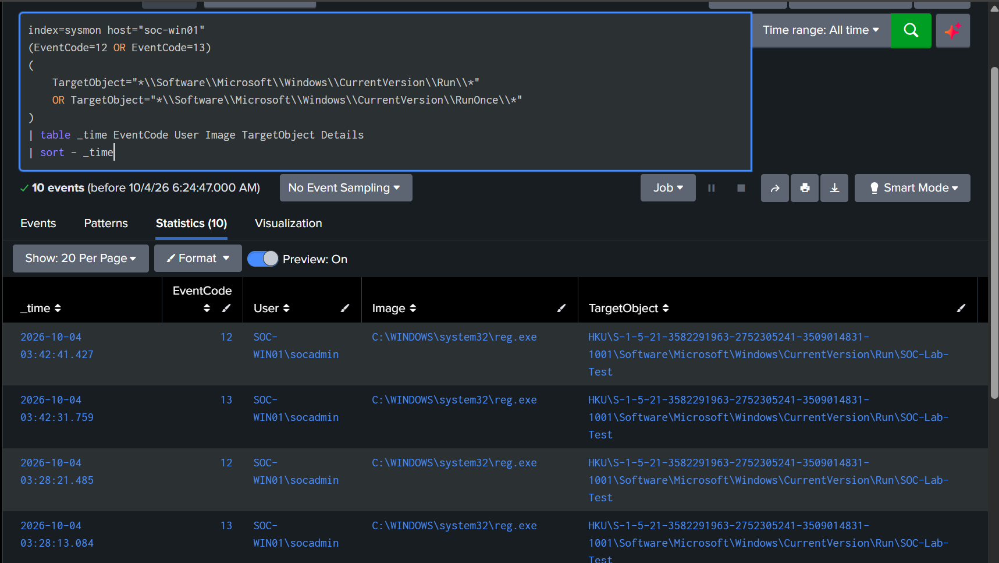
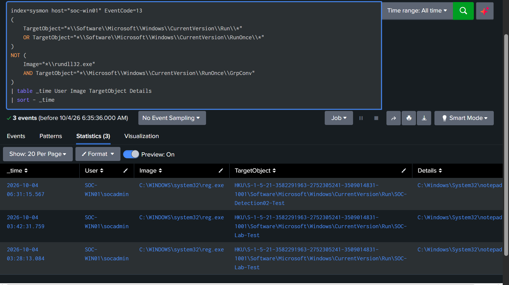
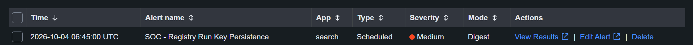

# Detection 02 — Registry Run Key Persistence

## Overview

This detection identifies modifications to Windows Registry Run and RunOnce keys on the monitored endpoint `SOC-WIN01`.

Windows Run and RunOnce registry locations can automatically execute programs when a user logs in. These locations are legitimate Windows functionality but can also be abused by attackers to establish persistence.

---

## Detection Objective

Detect registry value modifications involving:

- `CurrentVersion\Run`
- `CurrentVersion\RunOnce`

The detection focuses on Sysmon registry value modification events while excluding known legitimate baseline activity.

---

## Data Source

| Component | Value |
|---|---|
| Endpoint | `SOC-WIN01` |
| Telemetry Source | Sysmon |
| Sysmon Event ID | `13` — Registry Value Set |
| Splunk Index | `sysmon` |
| Splunk Host | `soc-win01` |
| SIEM | Splunk Enterprise |

---

## Baseline Analysis

Run and RunOnce registry activity was reviewed before creating the detection.

The baseline showed both controlled lab activity and legitimate Windows activity.

A known baseline event was observed involving:

- Process: `rundll32.exe`
- User: `NT AUTHORITY\SYSTEM`
- Registry location: `CurrentVersion\RunOnce\GrpConv`

This activity was excluded from the final detection to reduce false positives.

Evidence:



---

## Detection SPL

```spl
index=sysmon host="soc-win01" EventCode=13
(
    TargetObject="*\\Software\\Microsoft\\Windows\\CurrentVersion\\Run\\*"
    OR TargetObject="*\\Software\\Microsoft\\Windows\\CurrentVersion\\RunOnce\\*"
)
NOT (
    Image="*\\rundll32.exe"
    AND TargetObject="*\\Microsoft\\Windows\\CurrentVersion\\RunOnce\\GrpConv"
)
| table _time User Image TargetObject Details
| sort - _time
```

---

## Detection Logic

The detection requires:

1. Sysmon Event ID `13`, indicating a registry value was set.
2. A target containing a Windows `Run` or `RunOnce` registry location.
3. Exclusion of the known `rundll32.exe` `RunOnce\GrpConv` baseline activity.

This allows potentially suspicious persistence changes to be identified while reducing known legitimate noise.

---

## Validation Test

A harmless registry persistence entry was created on `SOC-WIN01`:

```powershell
reg add "HKCU\Software\Microsoft\Windows\CurrentVersion\Run" /v "SOC-Detection02-Test" /t REG_SZ /d "C:\Windows\System32\notepad.exe" /f
```

The registry value referenced `notepad.exe` and was used only to validate telemetry and detection logic.

---

## Detection Result

Splunk successfully detected the registry value modification.

The event showed:

- User: `SOC-WIN01\socadmin`
- Process: `reg.exe`
- Target: `CurrentVersion\Run\SOC-Detection02-Test`
- Data: `C:\Windows\System32\notepad.exe`

Evidence:



---

## Alert Configuration

The detection was converted into a scheduled Splunk alert.

| Setting | Configuration |
|---|---|
| Alert Name | `SOC - Registry Run Key Persistence` |
| Alert Type | Scheduled |
| Severity | Medium |
| Schedule | Every 5 minutes |
| Cron | `*/5 * * * *` |
| Search Window | Last 5 minutes |
| Trigger Condition | Number of Results > 0 |
| Alert Action | Add to Triggered Alerts |
| Suppression / Throttle | 10 minutes |

---

## Alert Validation

A second controlled Run-key persistence event was generated after the alert was enabled.

Splunk successfully generated the alert:

`SOC - Registry Run Key Persistence`

This validated the complete detection pipeline:

`SOC-WIN01 → Sysmon → Splunk Universal Forwarder → SOC-SPLUNK01 → Detection Search → Alert`

Evidence:



---

## False Positive Considerations

Legitimate software can modify Run and RunOnce registry locations.

Possible legitimate sources include:

- Software installers
- Application update mechanisms
- Windows components
- Enterprise management software
- Administrator configuration changes

Baseline analysis identified legitimate `rundll32.exe` activity targeting `RunOnce\GrpConv`, which was excluded from this detection.

Further tuning could include trusted applications, approved registry values, or known enterprise deployment tools.

---

## MITRE ATT&CK Mapping

| Technique | ID |
|---|---|
| Registry Run Keys / Startup Folder | `T1060` |

This technique represents persistence through registry locations that execute programs during user logon.

---

## Analyst Investigation Steps

When this alert triggers, an analyst should review:

1. The account that modified the registry.
2. The process responsible for the modification.
3. The full registry path.
4. The value written to the registry.
5. Whether the executable or script referenced is trusted.
6. Related process creation events.
7. Network connections around the same timestamp.
8. File creation activity.
9. Other registry modifications from the same host.
10. Whether the activity matches expected software installation or administration.

---

## Cleanup

The controlled registry values used during testing were removed after validation.

No persistence test entries were intentionally left active on `SOC-WIN01`.

---

## Status

**Detection validated successfully.**

The rule correctly detected a controlled Windows Run-key persistence simulation and generated a scheduled Splunk alert.
