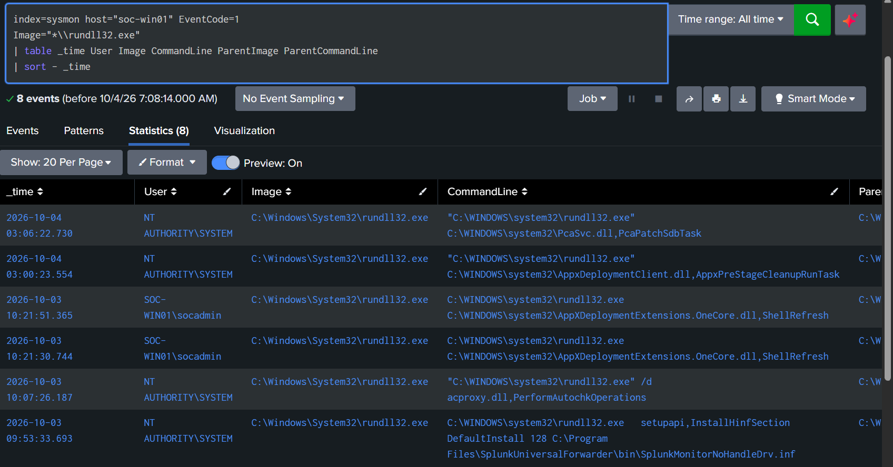
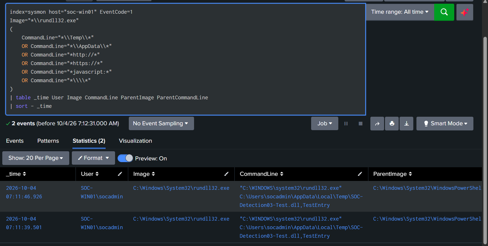
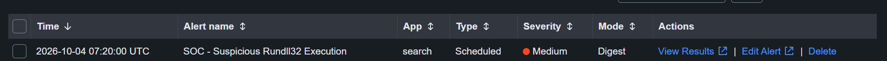

# Detection 03 — Suspicious Rundll32 Execution

## Overview

This detection identifies potentially suspicious use of `rundll32.exe` on the monitored Windows endpoint `SOC-WIN01`.

Rundll32 is a legitimate Windows utility used to execute functions exported from DLL files. Because it is a trusted Windows binary, attackers may abuse it to execute malicious content while blending in with normal system activity.

---

## Detection Objective

Detect `rundll32.exe` executions containing suspicious command-line characteristics such as:

- Execution from temporary directories
- Execution from user AppData locations
- References to HTTP or HTTPS resources
- JavaScript execution patterns
- UNC or remote paths

---

## Data Source

| Component | Value |
|---|---|
| Endpoint | `SOC-WIN01` |
| Telemetry Source | Sysmon |
| Sysmon Event ID | `1` — Process Creation |
| Splunk Index | `sysmon` |
| Splunk Host | `soc-win01` |
| SIEM | Splunk Enterprise |

---

## Baseline Analysis

Normal `rundll32.exe` execution was reviewed before creating the detection.

Observed legitimate activity included Windows and Splunk-related operations such as:

- `PcaSvc.dll,PcaPatchSdbTask`
- `AppxDeploymentClient.dll,AppxPreStageCleanupRunTask`
- `AppXDeploymentExtensions.OneCore.dll,ShellRefresh`
- `acproxy.dll,PerformAutochkOperations`
- Splunk Universal Forwarder driver installation activity

Because legitimate `rundll32.exe` activity exists on the system, the detection does not alert on every execution.

Evidence:



---

## Detection SPL

```spl
index=sysmon host="soc-win01" EventCode=1
Image="*\\rundll32.exe"
(
    CommandLine="*\\Temp\\*"
    OR CommandLine="*\\AppData\\*"
    OR CommandLine="*http://*"
    OR CommandLine="*https://*"
    OR CommandLine="*javascript:*"
    OR CommandLine="*\\\\*"
)
| table _time User Image CommandLine ParentImage ParentCommandLine
| sort - _time
```

---

## Detection Logic

The detection requires:

1. Sysmon Event ID `1`, indicating process creation.
2. Execution of `rundll32.exe`.
3. At least one suspicious command-line characteristic.

Instead of alerting on all Rundll32 activity, the rule focuses on patterns more likely to require analyst investigation.

---

## Validation Test

A harmless test command was executed on `SOC-WIN01`:

```powershell
rundll32.exe "$env:TEMP\SOC-Detection03-Test.dll",TestEntry
```

The referenced DLL did not exist and no malicious code was executed.

The purpose of the command was only to generate a Rundll32 process containing a suspicious temporary-directory path so Sysmon could capture the process creation event.

---

## Detection Result

Splunk successfully identified the controlled Rundll32 execution.

The event included:

- User: `SOC-WIN01\socadmin`
- Process: `C:\Windows\System32\rundll32.exe`
- Command line containing the user's temporary directory
- Parent process: PowerShell

Evidence:



---

## Alert Configuration

The detection was converted into a scheduled Splunk alert.

| Setting | Configuration |
|---|---|
| Alert Name | `SOC - Suspicious Rundll32 Execution` |
| Alert Type | Scheduled |
| Severity | Medium |
| Schedule | Every 5 minutes |
| Cron | `*/5 * * * *` |
| Search Window | Last 5 minutes |
| Trigger Condition | Number of Results > 0 |
| Alert Action | Add to Triggered Alerts |
| Suppression / Throttle | 10 minutes |

---

## Alert Validation

A second controlled test was executed after the alert was enabled:

```powershell
rundll32.exe "$env:TEMP\SOC-Detection03-Alert-Test.dll",TestEntry
```

Splunk successfully generated:

`SOC - Suspicious Rundll32 Execution`

This validated the complete detection pipeline:

`SOC-WIN01 → Sysmon → Splunk Universal Forwarder → SOC-SPLUNK01 → Detection Search → Alert`

Evidence:



---

## False Positive Considerations

Legitimate Windows and administrative activity may use `rundll32.exe`.

Potential false positives include:

- Windows maintenance
- Application installers
- Software updates
- Device configuration
- Administrative scripts
- Enterprise management tools

Analysts should consider the command line, parent process, user account, referenced DLL, file location, and related network activity before determining whether an event is malicious.

---

## MITRE ATT&CK Mapping

| Technique | ID |
|---|---|
| System Binary Proxy Execution: Rundll32 | `T1218.011` |

Rundll32 can be abused as a trusted Windows binary to proxy execution of malicious code.

---

## Analyst Investigation Steps

When this alert triggers, investigate:

1. The full Rundll32 command line.
2. The DLL or resource being referenced.
3. The location of the DLL.
4. The parent process.
5. The user account responsible for execution.
6. Whether the referenced file exists.
7. File hashes and reputation if applicable.
8. Related network connections.
9. DNS queries near the execution time.
10. Other process creation events involving the same user or parent process.

---

## Status

**Detection validated successfully.**

The rule successfully detected a controlled suspicious Rundll32 execution and generated a scheduled Splunk alert.
