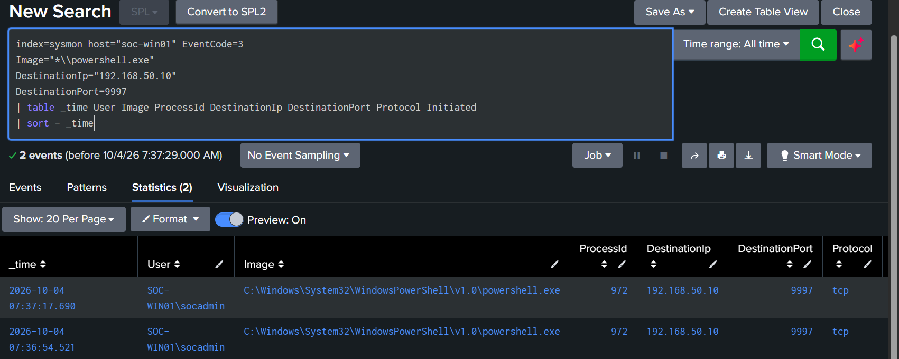

# Detection 04 — PowerShell Network Connection

## Overview

This detection identifies non-loopback network connections initiated by PowerShell on the monitored Windows endpoint `SOC-WIN01`.

PowerShell is a legitimate administrative tool, but network activity initiated by PowerShell can be security-relevant when it appears unexpectedly or alongside other suspicious behavior. This rule provides visibility into PowerShell-driven network communication for analyst review.

---

## Detection Objective

Identify network connections initiated by:

- `powershell.exe`
- `pwsh.exe`

while excluding local loopback traffic.

The detection is intended as a behavioral signal that can be correlated with process execution, command-line activity, file creation, registry changes, and other endpoint telemetry.

---

## Data Source

| Component | Value |
|---|---|
| Endpoint | `SOC-WIN01` |
| Telemetry Source | Sysmon |
| Sysmon Event ID | `3` — Network Connection |
| Splunk Index | `sysmon` |
| Splunk Host | `soc-win01` |
| SIEM | Splunk Enterprise |

---

## Baseline Analysis

A baseline search was first performed to identify existing PowerShell network activity:

```spl
index=sysmon host="soc-win01" EventCode=3
(Image="*\\powershell.exe" OR Image="*\\pwsh.exe")
| table _time User Image DestinationIp DestinationHostname DestinationPort Protocol Initiated
| sort - _time
```

At the time of testing, the baseline returned no normal PowerShell network connections.

Because no routine PowerShell network activity was observed, the initial lab detection was kept broad while excluding local loopback communication.

In a production environment, additional tuning would likely be required for legitimate administrative scripts, management systems, and approved automation.

---

## Detection SPL

```spl
index=sysmon host="soc-win01" EventCode=3
(Image="*\\powershell.exe" OR Image="*\\pwsh.exe")
NOT (DestinationIp="127.0.0.1" OR DestinationIp="::1")
| table _time User Image ProcessId DestinationIp DestinationHostname DestinationPort Protocol Initiated
| sort - _time
```

---

## Detection Logic

The rule requires:

1. Sysmon Event ID `3`, indicating a network connection.
2. The initiating process is Windows PowerShell or PowerShell Core.
3. The destination is not an IPv4 or IPv6 loopback address.

This provides visibility into outbound or non-loopback network communication initiated by PowerShell.

---

## Validation Test

The original HTTP test to Splunk Web on TCP `8000` failed because the lab firewall intentionally restricts Splunk Web access to the physical Windows host.

The firewall was not weakened for testing.

Instead, validation used the existing permitted Splunk receiver port `9997`, which already allows traffic from `SOC-WIN01`.

A controlled TCP connection was generated from PowerShell:

```powershell
$c = New-Object System.Net.Sockets.TcpClient
$c.Connect("192.168.50.10",9997)
Start-Sleep -Seconds 2
$c.Close()
```

This generated a benign network connection from PowerShell to the internal Splunk server.

---

## Detection Result

Splunk successfully identified the PowerShell network connection.

Observed values included:

- User: `SOC-WIN01\socadmin`
- Process: `powershell.exe`
- Destination IP: `192.168.50.10`
- Destination Port: `9997`
- Protocol: `tcp`
- Initiated: `true`

Evidence:



---

## Alert Configuration

The detection was converted into a scheduled Splunk alert.

| Setting | Configuration |
|---|---|
| Alert Name | `SOC - PowerShell Network Connection` |
| Alert Type | Scheduled |
| Severity | Medium |
| Schedule | Every 5 minutes |
| Cron | `*/5 * * * *` |
| Search Window | Last 5 minutes |
| Trigger Condition | Number of Results > 0 |
| Alert Action | Add to Triggered Alerts |
| Suppression / Throttle | 10 minutes |

---

## Alert Validation

A fresh controlled TCP connection was generated after the alert was enabled.

Splunk successfully generated:

`SOC - PowerShell Network Connection`

Evidence:


---

## False Positive Considerations

PowerShell can legitimately generate network traffic.

Potential legitimate causes include:

- Administrative scripts
- Software deployment
- Configuration management
- REST API calls
- Cloud administration
- Security tooling
- Update or automation workflows

Analysts should review the destination, port, initiating user, PowerShell command line, parent process, and nearby endpoint activity before determining whether the connection is malicious.

---

## MITRE ATT&CK Mapping

| Technique | ID |
|---|---|
| PowerShell | `T1059.001` |

This detection is primarily associated with PowerShell execution and is intended to provide network context for PowerShell-driven activity.

A network connection alone does not establish exfiltration, command-and-control, or another specific ATT&CK technique without additional evidence.

---

## Analyst Investigation Steps

When this alert triggers, review:

1. The user that launched PowerShell.
2. The destination IP address and hostname.
3. The destination port and protocol.
4. Whether the connection was initiated outbound.
5. The related PowerShell process creation event.
6. The PowerShell command line.
7. The parent process.
8. DNS queries near the same timestamp.
9. File and registry activity tied to the same process.
10. Whether the destination and behavior are expected for the environment.

Where possible, correlate using Sysmon `ProcessGuid` rather than relying only on timestamps or process IDs.

---

## Status

**Detection validated successfully.**

The rule detected a controlled PowerShell TCP connection and generated a scheduled Splunk alert without weakening the lab firewall configuration.
