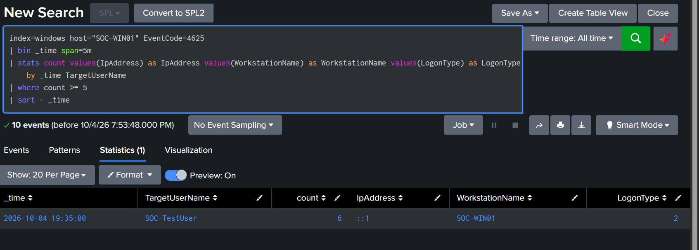
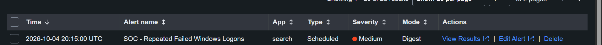

# Detection 05 — Repeated Failed Windows Logons

## Overview

This detection identifies repeated failed Windows logon attempts on the monitored endpoint `SOC-WIN01`.

Multiple authentication failures against the same account within a short period may indicate password guessing, brute-force activity, misconfigured applications, or user error.

---

## Detection Objective

Identify accounts experiencing five or more failed Windows logon attempts within a five-minute detection window.

---

## Data Source

| Component | Value |
|---|---|
| Endpoint | `SOC-WIN01` |
| Telemetry Source | Windows Security Event Log |
| Event ID | `4625` — Failed Logon |
| Splunk Index | `windows` |
| Splunk Host | `SOC-WIN01` |
| SIEM | Splunk Enterprise |

---

## Security Field Extraction

Windows Security logs were forwarded successfully, but fields such as `EventCode` were initially unavailable at search time.

The custom Splunk technical add-on was extended to support:

`XmlWinEventLog:Security`

This enabled automatic extraction of fields including:

- `EventCode`
- `TargetUserName`
- `IpAddress`
- `WorkstationName`
- `LogonType`
- `Status`
- `SubStatus`

Evidence:


---

## Detection SPL

```spl
index=windows host="SOC-WIN01" EventCode=4625
| stats count values(IpAddress) as IpAddress values(WorkstationName) as WorkstationName values(LogonType) as LogonType earliest(_time) as FirstSeen latest(_time) as LastSeen by TargetUserName
| where count >= 5
| convert ctime(FirstSeen) ctime(LastSeen)
```

---

## Detection Logic

The rule:

1. Searches Windows Security Event ID `4625`.
2. Groups failed attempts by target username.
3. Counts authentication failures within the alert search window.
4. Triggers when an account records five or more failures.

The scheduled alert searches the previous five minutes, providing the detection time window.

---

## Validation Test

A controlled fake username was used:

`SOC-TestUser`

Multiple failed authentication attempts were generated using:

```powershell
runas /user:SOC-WIN01\SOC-TestUser cmd.exe
```

An incorrect password was supplied repeatedly.

A nonexistent test account was used so the real administrative account would not be placed at risk of account lockout.

---

## Detection Result

Splunk identified six failed authentication attempts against:

`SOC-TestUser`

Observed information included:

- Target user: `SOC-TestUser`
- Failed attempts: `6`
- Workstation: `SOC-WIN01`
- Logon type: `2`
- Source address: `::1`

Evidence:



---

## Alert Configuration

| Setting | Configuration |
|---|---|
| Alert Name | `SOC - Repeated Failed Windows Logons` |
| Alert Type | Scheduled |
| Severity | Medium |
| Schedule | Every 5 minutes |
| Cron | `*/5 * * * *` |
| Search Window | Last 5 minutes |
| Trigger Condition | Number of Results > 0 |
| Threshold | 5 or more failed logons |
| Alert Action | Add to Triggered Alerts |
| Suppression / Throttle | 10 minutes |

---

## Alert Validation

A second controlled set of failed authentication attempts was generated after the scheduled alert was enabled.

Splunk successfully generated:

`SOC - Repeated Failed Windows Logons`

Evidence:



---

## False Positive Considerations

Repeated failed authentication does not automatically indicate malicious activity.

Possible legitimate causes include:

- Users mistyping passwords
- Recently changed passwords
- Cached credentials
- Scheduled tasks using old credentials
- Services using expired credentials
- Misconfigured applications

Analysts should review the account, source system, source IP address, logon type, frequency, and surrounding authentication activity.

---

## MITRE ATT&CK Mapping

| Technique | ID |
|---|---|
| Brute Force: Password Guessing | `T1110.001` |

---

## Analyst Investigation Steps

When this alert triggers, review:

1. The target username.
2. Number of failed attempts.
3. Source IP address.
4. Workstation name.
5. Logon type.
6. Failure status and substatus codes.
7. Whether a successful logon followed the failures.
8. Other accounts targeted from the same source.
9. Authentication activity around the same time.
10. Whether the activity is consistent with normal user behavior.

---

## Status

**Detection validated successfully.**

The rule identified repeated controlled failed logons and generated a scheduled Splunk alert.
