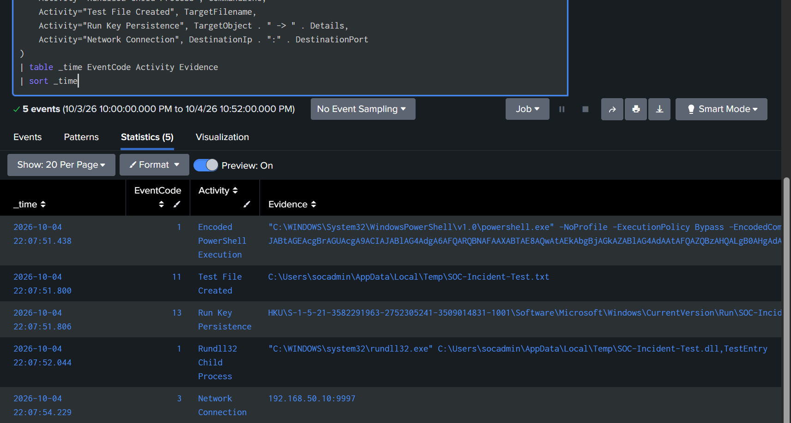
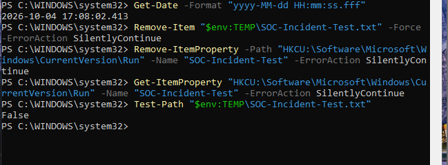

# Incident Response

## Overview

This document describes the investigation and response workflow used in the completed SOC/SIEM lab.

The project uses a repeatable defensive workflow:

**Alert → Validate → Scope → Correlate → Investigate → Build Timeline → Assess → Contain / Remediate → Validate Cleanup → Document**

## Controlled Incident

A controlled PowerShell incident was generated on SOC-WIN01 to validate the complete investigation workflow.

The simulation produced:

1. Encoded PowerShell execution
2. Temporary file creation
3. Registry Run-key persistence
4. Rundll32 child-process execution
5. TCP network communication

No real malware was used.

[View the full incident investigation](../incidents/01-controlled-powershell-incident.md)

## Investigation Methodology

### 1. Alert Validation

Triggered Splunk alerts were reviewed to identify suspicious activity near the simulation time.

### 2. Initial Process Identification

The initial encoded PowerShell process was isolated using Sysmon Event ID 1.

Key identifiers:

- User: SOC-WIN01\socadmin
- Process ID: 1800
- Process GUID: {cfe05231-ce36-6ac2-6901-000000000700}
- Event time: 2026-10-04 22:07:51.438 UTC

### 3. Process-GUID Correlation

The Sysmon Process GUID was used to correlate related events back to the exact PowerShell process.

This was more reliable than using only timestamps or process IDs because it uniquely tied together the execution chain.

### 4. Evidence Collection

The investigation correlated:

| Time (UTC) | Sysmon Event ID | Activity |
|---|---:|---|
| 22:07:51.438 | 1 | Encoded PowerShell execution |
| 22:07:51.800 | 11 | Test file created |
| 22:07:51.806 | 13 | Registry Run-key persistence |
| 22:07:52.044 | 1 | Rundll32 child process launched |
| 22:07:54.229 | 3 | TCP connection to 192.168.50.10:9997 |

### 5. Persistence Analysis

PowerShell created the following Run-key value:

**HKCU\Software\Microsoft\Windows\CurrentVersion\Run\SOC-Incident-Test**

The controlled value pointed to Windows Notepad and was used only to demonstrate persistence telemetry.

### 6. Network Analysis

The same PowerShell process initiated a TCP connection to:

**192.168.50.10:9997**

This destination was the internal Splunk server and was intentionally selected as a safe lab endpoint.

### 7. Child-Process Analysis

PowerShell launched rundll32.exe with a temporary-path DLL reference:

**C:\Users\socadmin\AppData\Local\Temp\SOC-Incident-Test.dll,TestEntry**

The DLL did not exist. The command was used only to create benign process telemetry.

## MITRE ATT&CK Mapping

| Behavior | Technique | ID |
|---|---|---|
| PowerShell execution | PowerShell | T1059.001 |
| Run-key persistence | Registry Run Keys / Startup Folder | T1547.001 |
| Rundll32 execution | System Binary Proxy Execution: Rundll32 | T1218.011 |

## Production Response Considerations

If comparable activity occurred outside an authorized simulation, recommended actions would include:

1. Isolate the endpoint if compromise is suspected.
2. Preserve endpoint and SIEM evidence.
3. Investigate the initiating account.
4. Review the full PowerShell command line and decode suspicious content safely.
5. Examine persistence locations.
6. Inspect referenced files and calculate hashes where appropriate.
7. Review network destinations and related DNS activity.
8. Search for the same indicators across other endpoints.
9. Remove unauthorized persistence.
10. Reset affected credentials when compromise is suspected.
11. Continue monitoring for recurrence.

## Cleanup and Validation

After the controlled investigation:

- SOC-Incident-Test.txt was removed.
- The SOC-Incident-Test Run-key value was removed.
- File removal was validated with Test-Path returning False.

## Current Status

**Complete — controlled incident investigated, correlated, remediated, validated, and documented.**
