# Lab Setup

## Overview

This document records the completed deployment and validation of the SOC/SIEM home lab.

## Current Status

**Complete**

The final environment includes:

- SOC-SPLUNK01 — Ubuntu Server 24.04.5 LTS running Splunk Enterprise 10.6.0.5
- SOC-WIN01 — Windows 11 Pro monitored with Sysmon and Splunk Universal Forwarder
- VMnet2 isolated lab network — 192.168.50.0/24
- Dedicated windows and sysmon indexes
- Custom search-time field extraction
- Five validated detections and scheduled alerts
- SOC Security Monitoring Dashboard
- Controlled incident investigation

## VMware Network Configuration

A dedicated VMware host-only network was created for lab communication.

### Lab Network

- Network: VMnet2
- Network type: Host-only / isolated lab network
- Subnet: 192.168.50.0/24
- Subnet mask: 255.255.255.0
- Host virtual adapter: Enabled
- Host VMnet2 address: 192.168.50.1
- VMware DHCP: Disabled

Static lab addresses:

| System | IP Address |
|---|---|
| SOC-SPLUNK01 | 192.168.50.10 |
| SOC-WIN01 | 192.168.50.20 |

Both virtual machines also retain VMware NAT adapters for trusted updates and official software downloads.

Evidence:

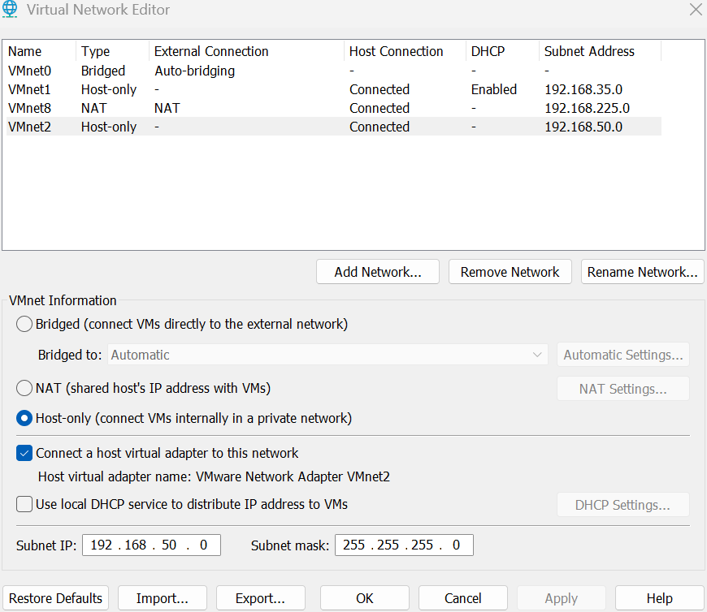

## SOC-SPLUNK01 Virtual Machine

### Virtual Machine Configuration

- VM name: SOC-SPLUNK01
- Operating system: Ubuntu Server 24.04.5 LTS
- Memory: 8 GB
- vCPU: 4
- Virtual disk: 100 GB
- Storage location: C:\VMs\SOC-SPLUNK01

Evidence:

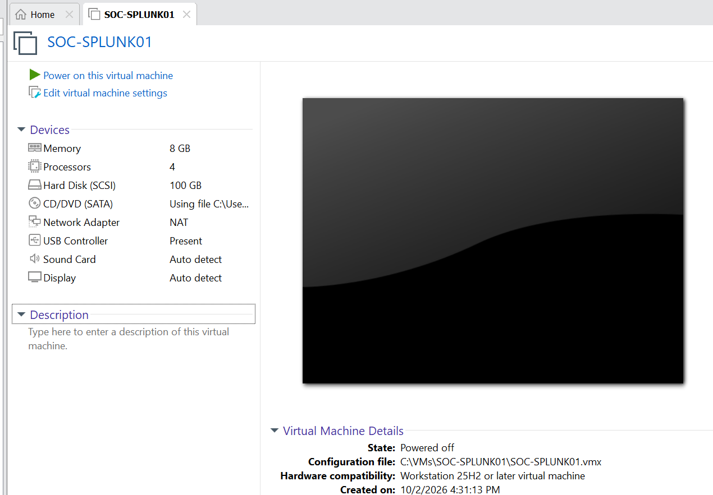

## SOC-SPLUNK01 Network Configuration

### NAT Interface

- Interface: ens33
- Address observed during deployment: 192.168.225.128/24
- Purpose: trusted Internet access
- Default route: VMware NAT

### Lab Interface

- Interface: ens37
- Address: 192.168.50.10/24
- Network: VMnet2
- Default gateway: none

The lab interface carries management and telemetry traffic without providing a default Internet route.

Evidence:

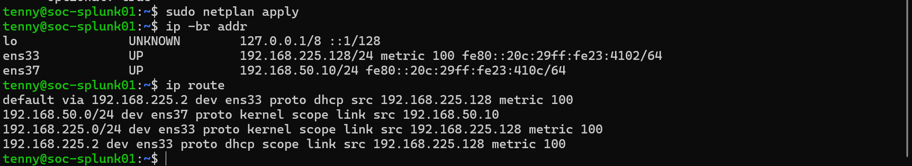

## Host-to-Splunk Connectivity

The Windows physical host was validated against SOC-SPLUNK01 over VMnet2.

- Host VMnet2 address: 192.168.50.1
- Splunk lab address: 192.168.50.10
- ICMP: successful
- SSH TCP 22: reachable
- Splunk Web TCP 8000: reachable

Evidence:

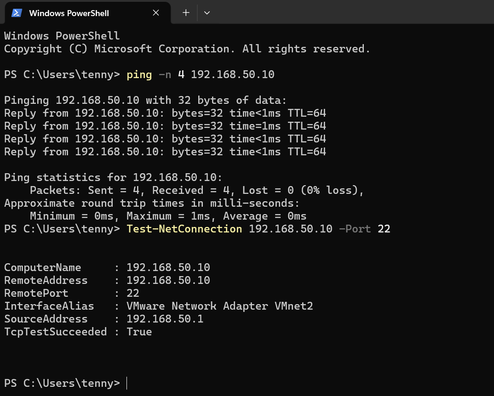

## Splunk Enterprise Deployment

Splunk Enterprise was installed from the official Linux AMD64 Debian package.

### Installation Details

- Version: 10.6.0.5
- Installation directory: /opt/splunk
- Service account: splunk
- Splunk Web: TCP 8000
- Forwarder receiver: TCP 9997

The downloaded package was verified against the published SHA-512 checksum before installation.

Evidence:

- [Package checksum verification](../images/08-splunk-package-checksum-verification.png)
- [Splunk installation validation](../images/09-splunk-install-validation.png)
- [Splunk first start](../images/10-splunk-first-start.png)
- [Splunk Web home](../images/11-splunk-web-home.png)

## Splunk Automatic Startup

Splunk was configured as a systemd-managed service using the dedicated splunk account.

Validation confirmed:

- Splunkd enabled at boot
- Splunkd active after reboot
- Splunk CLI confirmed the service was running

Evidence:

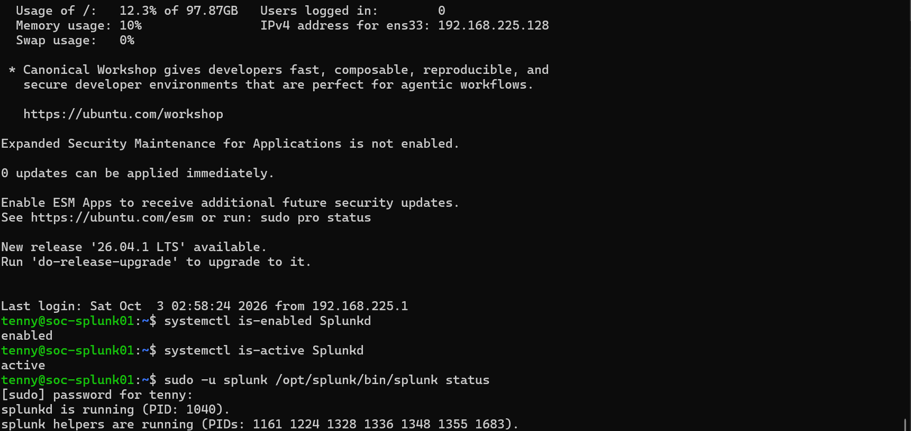

## Splunk Receiving Port

Splunk Enterprise was configured to receive forwarder data on TCP 9997.

Evidence:

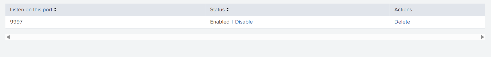

## Splunk Security Indexes

Dedicated indexes separate standard Windows logs from Sysmon telemetry.

| Index | Purpose |
|---|---|
| windows | Windows Security, System, and Application logs |
| sysmon | Microsoft Sysmon Operational telemetry |

Evidence:

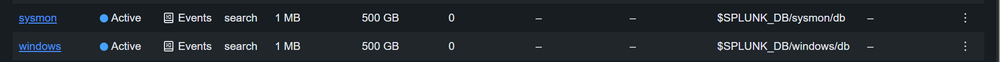

## Splunk Server Firewall Hardening

Ubuntu UFW was enabled with source-restricted access on the isolated interface.

| Port | Service | Allowed Source |
|---|---|---|
| 22/TCP | SSH | 192.168.50.1 |
| 8000/TCP | Splunk Web | 192.168.50.1 |
| 9997/TCP | Splunk Forwarder receiver | 192.168.50.20 |

TCP 8089 is not exposed to other systems in the lab.

Evidence:

- [Splunk Firewall Rules](../images/15-splunk-firewall-rules.png)
- [Splunk Firewall Validation](../images/16-splunk-firewall-validation.png)

## SOC-WIN01 Virtual Machine

### Virtual Machine Configuration

- VM name: SOC-WIN01
- Operating system: Windows 11 Pro
- Memory: 8 GB
- vCPU: 4
- Virtual disk: 80 GB
- Virtual TPM: enabled
- Storage location: C:\VMs\SOC-WIN01

Evidence:

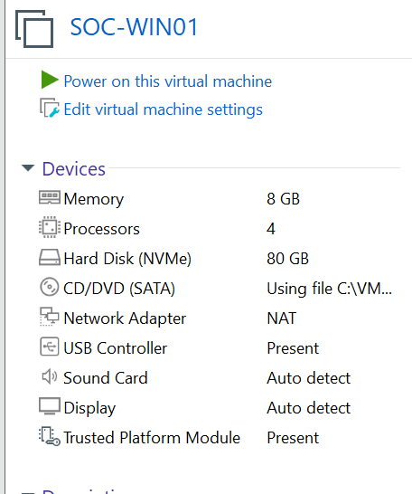

## Windows Installation and VMware Tools

Windows 11 Pro was installed and updated. VMware Tools was installed and validated.

Evidence:

- [Windows installation complete](../images/19-windows-installation-complete.png)
- [Windows system validation](../images/20-windows-system-validation.png)
- [Windows update validation](../images/21-windows-update-validation.png)
- [VMware Tools validation](../images/22-vmware-tools-validation.png)

## SOC-WIN01 Network Configuration

SOC-WIN01 uses two adapters.

### NAT Interface

- Interface: Ethernet0
- Purpose: trusted Internet access

### Lab Interface

- Interface: Ethernet1
- Address: 192.168.50.20/24
- Network: VMnet2
- Default gateway: none

Connectivity from SOC-WIN01 to SOC-SPLUNK01 TCP 9997 was validated successfully.

Evidence:

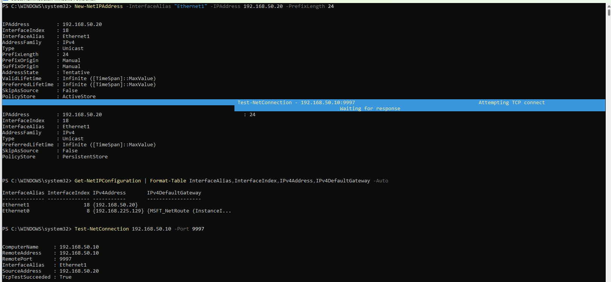

## Sysmon Deployment

Sysmon 15.22 was downloaded from Microsoft, its Authenticode signature was validated, and Sysmon64 was installed as a Windows service.

Evidence:

- [Sysmon Signature Verification](../images/24-sysmon-signature-verification.png)
- [Sysmon Installation Validation](../images/25-sysmon-install-validation.png)
- [Sysmon Configuration Validation](../images/26-sysmon-configuration-validation.png)

## Sysmon Telemetry Validation

Controlled tests validated:

| Event ID | Activity |
|---|---|
| 1 | Process creation |
| 3 | Network connection |
| 11 | File creation |
| 22 | DNS query |

Evidence:

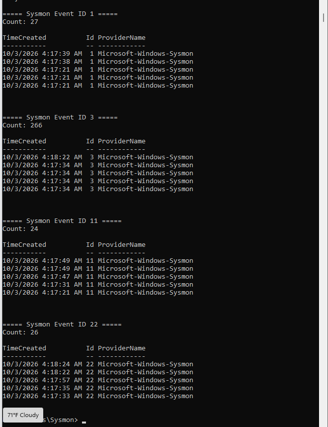

## Splunk Universal Forwarder

The official Splunk Universal Forwarder 10.6.0.5 Windows MSI was verified and installed on SOC-WIN01.

The forwarder sends data to:

**192.168.50.10:9997**

Monitored logs:

- Application
- System
- Security
- Microsoft-Windows-Sysmon/Operational

Destination indexes:

- windows
- sysmon

Evidence:

- [Forwarder checksum verification](../images/28-splunk-forwarder-package-verification.png)
- [Forwarder connection validation](../images/29-splunk-forwarder-connection-validation.png)
- [Windows log ingestion validation](../images/30-windows-log-ingestion-validation.png)
- [Sysmon ingestion validation](../images/31-sysmon-ingestion-validation.png)

## Sysmon Event ID Validation

Splunk successfully received the expected Sysmon event types.

Evidence:

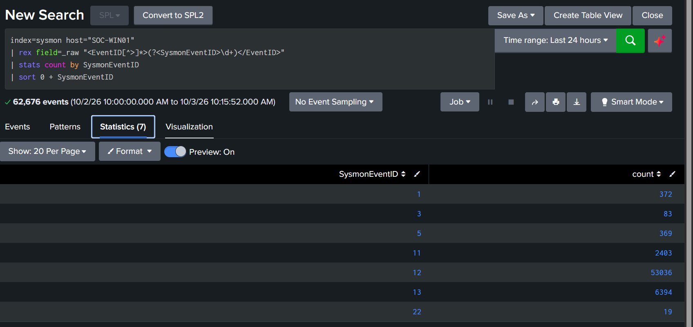

## Sysmon Registry Tuning

Initial registry telemetry was excessively noisy, with Event IDs 12 and 13 dominating results.

The Sysmon configuration was tuned to retain security-relevant registry locations such as:

- Run
- RunOnce
- Services
- Image File Execution Options
- Winlogon
- Windows Defender exclusions and policies
- Windows policies related to system configuration

A controlled Run-key test verified that persistence telemetry remained visible after tuning.

Evidence:

- [Tuned Sysmon Configuration](../images/33-sysmon-tuned-configuration.png)
- [Noise Reduction Validation](../images/34-sysmon-noise-reduction-validation.png)
- [Registry Persistence Validation](../images/35-sysmon-registry-persistence-validation.png)

## Sysmon Search-Time Field Extraction

The Sysmon sourcetype is:

**XmlWinEventLog:Microsoft-Windows-Sysmon/Operational**

A custom Splunk technical add-on named **TA-soc-lab-sysmon** was created to extract fields such as:

- EventCode
- User
- Image
- CommandLine
- ParentImage
- ParentCommandLine
- TargetFilename
- TargetObject
- DestinationIp
- DestinationPort

The add-on is exported at system scope so the fields are available in Search & Reporting.

Evidence:

- [Sysmon Sourcetype Validation](../images/36-sysmon-sourcetype-validation.png)
- [EventCode Field Extraction](../images/37-sysmon-eventcode-field-extraction.png)
- [Sysmon Field Extraction Validation](../images/38-sysmon-field-extraction-validation.png)

## Windows Security Field Extraction

The same custom add-on was extended to the Windows Security sourcetype:

**XmlWinEventLog:Security**

This enabled direct searching of:

- EventCode
- TargetUserName
- IpAddress
- WorkstationName
- LogonType
- Status
- SubStatus

Evidence:

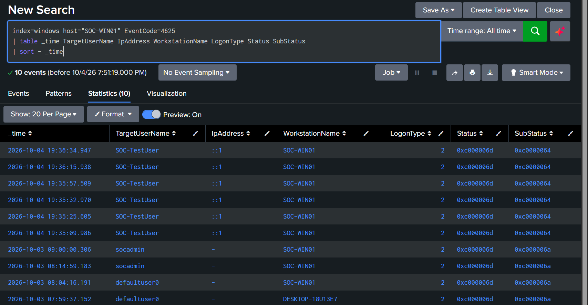

## Detection and Alert Validation

Five security detections were baselined, tuned, tested, and converted into scheduled Splunk alerts.

See:

[Detection Engineering](detections.md)

## SOC Dashboard

A Splunk Dashboard Studio dashboard was created with endpoint, authentication, network, event-volume, and detection views.

Evidence:

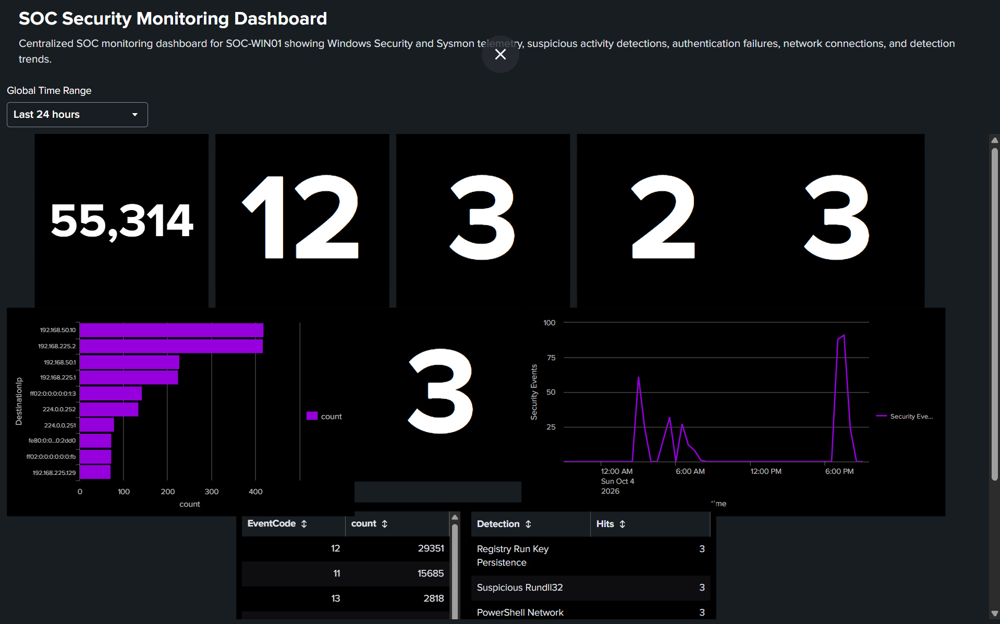

## Controlled Incident Investigation

A controlled PowerShell incident was used to validate alert triage, Sysmon ProcessGuid correlation, registry analysis, network analysis, child-process investigation, timeline reconstruction, and cleanup.

See:

[Incident Response](incident-response.md)

[Full Incident Investigation](../incidents/01-controlled-powershell-incident.md)

## Final Validation

The lab now provides an end-to-end defensive workflow:

**Windows telemetry → Splunk forwarding → indexing → field extraction → detection → scheduled alert → dashboard → investigation → remediation → documentation**

## Current Status

**Complete**
