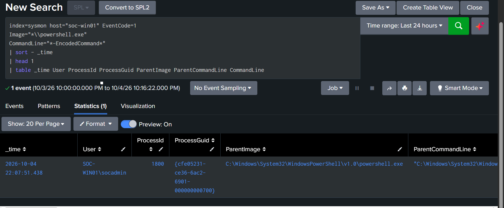
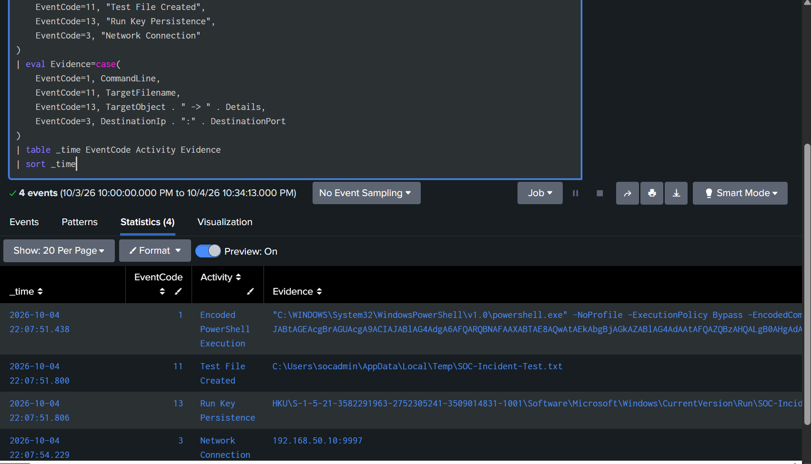
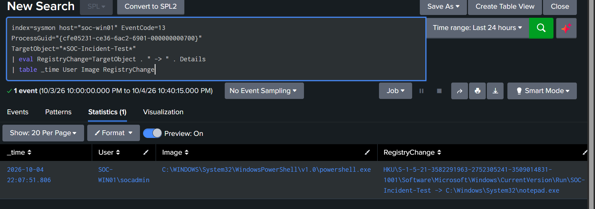
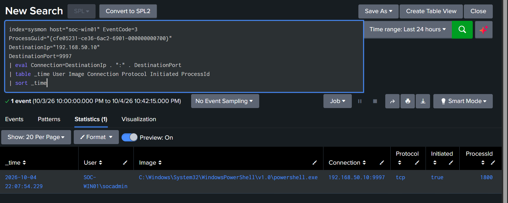
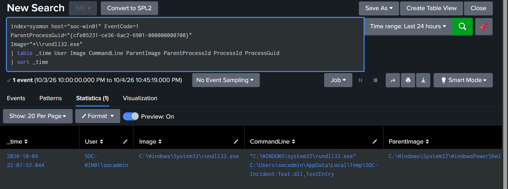

# Incident 01 — Controlled PowerShell Incident Investigation

## Executive Summary

A controlled security incident was generated on `SOC-WIN01` to validate the SOC monitoring and investigation workflow implemented in this lab.

The simulated activity used encoded PowerShell to perform several behaviors commonly associated with malicious activity:

- Encoded PowerShell execution
- File creation in the user's temporary directory
- Registry Run-key persistence
- Rundll32 execution referencing a temporary DLL path
- An outbound TCP connection

Splunk and Sysmon telemetry were used to correlate the activity, reconstruct the timeline, and validate that multiple behaviors originated from the same PowerShell process.

This was a controlled simulation. No malicious payload was executed.

---

## Incident Details

| Field | Value |
|---|---|
| Incident | Controlled PowerShell Incident |
| Endpoint | `SOC-WIN01` |
| User | `SOC-WIN01\socadmin` |
| Data Source | Sysmon |
| SIEM | Splunk Enterprise |
| Incident Date | October 4, 2026 |
| Approximate Simulation Time | `17:08` local |
| Primary Process | `powershell.exe` |
| Process ID | `1800` |
| Process GUID | `{cfe05231-ce36-6ac2-6901-000000000700}` |
| Status | Investigated and cleaned up |

---

## Initial Alert / Detection

The investigation identified an encoded PowerShell process at:

`2026-10-04 22:07:51.438 UTC`

The process executed as:

`SOC-WIN01\socadmin`

and contained command-line arguments associated with suspicious PowerShell behavior, including:

- `-ExecutionPolicy Bypass`
- `-EncodedCommand`

Evidence:



---

## Initial Process Identification

The suspicious PowerShell execution was associated with:

```text
ProcessId: 1800
ProcessGuid: {cfe05231-ce36-6ac2-6901-000000000700}
```

The Process GUID was used as the primary correlation identifier throughout the investigation.

Using Process GUID correlation allowed multiple Sysmon event types to be linked to the same process rather than relying only on timestamps.

---

## Correlated Activity

Splunk identified multiple behaviors associated with the same PowerShell Process GUID.

The correlated activity included:

1. Encoded PowerShell execution
2. Temporary file creation
3. Registry Run-key persistence
4. Rundll32 child-process execution
5. Network communication

Evidence:



---

## Registry Persistence

The PowerShell process modified the current user's Windows Run registry key.

Registry path:

```text
HKU\<USER-SID>\Software\Microsoft\Windows\CurrentVersion\Run\SOC-Incident-Test
```

Registry value:

```text
C:\Windows\System32\notepad.exe
```

This demonstrated a persistence technique in which an application could be configured to execute when the user logs in.

The event was recorded using Sysmon Event ID `13`.

Evidence:



---

## Network Activity

The same PowerShell process initiated a TCP network connection.

Observed connection:

```text
Source Process: powershell.exe
Destination IP: 192.168.50.10
Destination Port: 9997
Protocol: TCP
Initiated: true
Process ID: 1800
```

The destination was the lab Splunk server and was intentionally used as a safe internal destination for the controlled simulation.

The event was recorded using Sysmon Event ID `3`.

Evidence:



---

## Rundll32 Child Process

The PowerShell process launched:

```text
C:\Windows\System32\rundll32.exe
```

with a command line referencing:

```text
C:\Users\socadmin\AppData\Local\Temp\SOC-Incident-Test.dll,TestEntry
```

The DLL did not exist and no malicious code was executed.

The purpose of this activity was to simulate suspicious Rundll32 usage and demonstrate parent-child process correlation.

Evidence:



---

## Incident Timeline

| Time (UTC) | Event ID | Activity |
|---|---:|---|
| `22:07:51.438` | 1 | Encoded PowerShell execution |
| `22:07:51.800` | 11 | Test file created |
| `22:07:51.806` | 13 | Registry Run-key persistence |
| `22:07:52.044` | 1 | Rundll32 child process launched |
| `22:07:54.229` | 3 | TCP network connection to `192.168.50.10:9997` |

Evidence:


---

## File Activity

The PowerShell process created the following marker file:

```text
C:\Users\socadmin\AppData\Local\Temp\SOC-Incident-Test.txt
```

The file contained only a controlled lab marker and was used to validate Sysmon file-creation telemetry.

The event was recorded using Sysmon Event ID `11`.

---

## MITRE ATT&CK Mapping

| Behavior | Technique | ID |
|---|---|---|
| Encoded PowerShell execution | PowerShell | `T1059.001` |
| Registry Run-key persistence | Registry Run Keys / Startup Folder | `T1547.001` |
| Rundll32 execution | System Binary Proxy Execution: Rundll32 | `T1218.011` |

The simulation was designed to demonstrate several behaviors across execution and persistence categories rather than reproduce a specific real-world malware family.

---

## Analyst Findings

The investigation determined that:

- A suspicious encoded PowerShell command executed under `SOC-WIN01\socadmin`.
- The process was identified as PID `1800`.
- Sysmon assigned the process GUID `{cfe05231-ce36-6ac2-6901-000000000700}`.
- The same process created a temporary marker file.
- The process modified a Windows Run registry key.
- The process launched Rundll32 with a DLL path located under the user's temporary directory.
- The same PowerShell process initiated a TCP connection to `192.168.50.10:9997`.
- The events occurred within approximately three seconds of one another.
- Process GUID correlation established that the activity belonged to the same execution chain.

---

## Analyst Assessment

The observed combination of:

- Encoded PowerShell
- Registry persistence
- Execution through Rundll32
- Temporary-file activity
- Network communication

would warrant escalation and additional investigation in a production SOC environment.

Individually, some of these behaviors can occur legitimately. When correlated together within a short period and tied to the same process, however, the activity becomes significantly more suspicious.

For this lab, the behavior was confirmed to be a controlled simulation.

---

## Recommended Response in a Production Environment

If this activity were not an authorized simulation, recommended actions would include:

1. Isolate the affected endpoint.
2. Preserve relevant endpoint and SIEM evidence.
3. Terminate suspicious PowerShell and child processes if appropriate.
4. Investigate the Run-key persistence mechanism.
5. Examine referenced files and calculate cryptographic hashes.
6. Review destination IP addresses and network activity.
7. Investigate the initiating user account.
8. Search for similar behavior across other endpoints.
9. Remove unauthorized persistence mechanisms.
10. Reset affected credentials if compromise is suspected.
11. Continue monitoring for recurrence.

---

## Cleanup

After the controlled investigation, the test artifacts were removed.

Removed file:

```text
C:\Users\socadmin\AppData\Local\Temp\SOC-Incident-Test.txt
```

Removed registry value:

```text
HKCU\Software\Microsoft\Windows\CurrentVersion\Run\SOC-Incident-Test
```

Validation confirmed that the marker file no longer existed.

Evidence:


---

## Conclusion

The SOC monitoring environment successfully detected and correlated multiple security-relevant behaviors originating from a single PowerShell process.

The investigation demonstrated the ability to:

- Investigate Splunk alerts
- Analyze Sysmon telemetry
- Track process relationships
- Correlate activity using Process GUIDs
- Identify persistence mechanisms
- Analyze network activity
- Reconstruct an incident timeline
- Map activity to MITRE ATT&CK
- Perform post-investigation cleanup

**Incident Status: Closed — Controlled Simulation**
